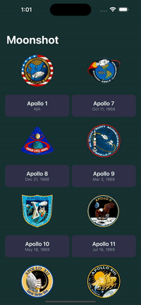

# Moonshot
 An iOS containing information about Apollo space program including missions and astronauts.  
  
 
# Installation
 1. Open up Xcode
 2. Click on File > Open
 3. Select Moonshot.xcodeproj
 4. Press Command+R to Build and Run
